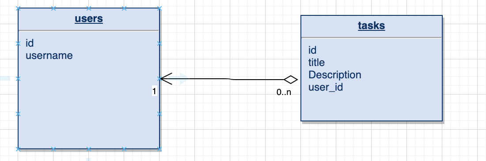

# Intro to SqlAlchemy

**Duration: 120 minutes**

## Learning Objectives

- Understand what an ORM is.
- Understand what SqlAlchemy does
- Be able to configure SqlAlchemy with Flask.
- Use SqlAlchemy to Read from SQLite database.
- Use SqlAlchemy to Create a new entry in SQLite database.

## Introduction

So far our data is hard coded in the app. This is an issue as every time we restart the server our data is recreated. So if we were to add new tasks then we would lose them every time we restart.

Flask does not support databases natively. This is one of the many areas in which Flask is intentionally not opinionated, which is great, because you have the freedom to choose the database that best fits your application instead of being forced to adapt to one.

To solve this problem we will be using an ORM called SqlAlchemy and an SQLite database.

### Why use an ORM?

ORM stands for Object Relational Mapping. Looking at each of these words will explain their use in the real world:

- Object - This part represents the objects and programming language where the framework is used, for example Python.

- Relational - This part represents the RDBMS database you're using (Relational Database Manager System). There are numerous popular relational databases out there, but you're probably using on of the following - MSSQL, MySQL, Oracle Database, PostgreSQL.
What's common between most relational databases is their relational structures (tables, columns, keys, constraints, etc.).

- Mapping - This final part represents the bridge and connection between the two previous parts, the objects and the database tables.

A common task when programming any web service is to create a robust database backend. Traditionally, programmers would write raw SQL statements, pass them to the database engine and parse the returned results as a normal array of records. Like such:

```python
import sqlite3
conn = sqlite3.connect('example.db')

c = conn.cursor()
c.execute('''
          CREATE TABLE users
          (id INTEGER PRIMARY KEY ASC, name varchar(250) NOT NULL)
          ''')
c.execute('''
          CREATE TABLE tasks
          (id INTEGER PRIMARY KEY ASC, title varchar(250), description varchar(250),
          user_id INTEGER NOT NULL,
           FOREIGN KEY(user_id) REFERENCES users(id))
          ''')

c.execute('''
          INSERT INTO users VALUES(1, 'Sandy')
          ''')
c.execute('''
          INSERT INTO tasks VALUES(1, 'Learn Python', 'Get to grips with this language!', 1)
          ''')

conn.commit()
conn.close()
```

Nowadays, programmers can use Object-relational mapping (ORM) programs to remove the necessity of writing tedious and error-prone raw SQL statements that are inflexible and hard-to-maintain.

ORM is a tool for converting data between incompatible types in object-oriented programming languages. Usually, the classes used in an OO language, such as Python, contains types that cannot be expressed as primitives, such as integers and strings. For example, a User object may have a list of Task objects.

In order to deal with the complexity of managing objects, ORMs were developed. Our to-do list can be expressed as an ORM system with a User class, and a Task class, where each class maps to a table in the underlying database. Instead of writing database interfacing code yourself, an ORM takes care of these issues for you while you can focus on programming the logics of the system.

We want to create a database with the following structure:




### SqlAlchemy

We will be using a popular ORM called SqlAlchemy.

SQLAlchemy is the Python SQL toolkit and Object Relational Mapper that gives application developers the full power and flexibility of SQL.

There are three most important components in writing SQLAlchemy code:

- A Table that represents a table in a database.
- A mapper that maps a Python class to a table in a database.
- A class object that defines how a database record maps to a normal Python object.

Instead of having to write code for Table, mapper and the class object at different places, SQLAlchemy allows a Table, a Mapper and a Class object to be defined at once in one class definition.

### Installing and Configuring SqlAlchemy

To install `Flask-SQLAlchemy` in your virtual environment, make sure you have activated it first, and then run:

```bash
pip3 install flask-sqlalchemy
```

We also need to address making updates to an existing database as the application needs change or grow. This is hard because relational databases are centred around structured data, so when the structure changes the data that is already in the database needs to be migrated to the modified structure.

The second extension we will install is `Flask-Migrate`.

This extension is a Flask wrapper for `Alembic`, a database migration framework for SQLAlchemy. Working with database migrations adds a bit of work to get a database started, but that is a small price to pay for a robust way to make changes to your database in the future.

```bash
pip3 install flask-migrate
```

We are going to use an SQLite database. SQLite databases are a convenient choice for developing small applications as each database is stored in a single file in the root of the application and there is no need to run a database server like MySQL and PostgreSQL.

To configure the database we __could__ put the configuration in our `__init__.py` file in the app package.... but we should really be separating our concerns.

So instead of putting the configuration in the same place where we created the application we will keep my configuration in a separate file.

A good format is to use a class to store configuration variables. To keep things nicely organised.

We will create the configuration class in a  config.py module in the top-level directory.

```bash
touch config.py
```

The configuration settings are defined as class variables inside a `Config` class. As the application needs more configuration items, they can be added to this class.

We will also import `os` so that we can get the full path to the new database file.

```python
# config.py

import os
basedir = os.path.abspath(os.path.dirname(__file__))

class Config(object):
    # ...
    SQLALCHEMY_DATABASE_URI ='sqlite:///' + os.path.join(basedir, 'app.db')
    SQLALCHEMY_TRACK_MODIFICATIONS = False
```

The `Flask-SQLAlchemy` extension takes the location of the application's database from the SQLALCHEMY_DATABASE_URI configuration variable. We are configuring a database named app.db located in the main directory of the application, which is stored in the `basedir` variable.

The SQLALCHEMY_TRACK_MODIFICATIONS configuration option is set to False to disable a feature of Flask-SQLAlchemy that we do not need, which is to signal the application every time a change is about to be made in the database.

Now in `__init__.py` we will create an instance of the databse and the database migration engine.

We will also import our new configuration object.

```python
# __init__.py

from flask import Flask
from config import Config # ADDED
from flask_sqlalchemy import SQLAlchemy # ADDED
from flask_migrate import Migrate # ADDED

app = Flask(__name__)
app.config.from_object(Config) #ADDED
db = SQLAlchemy(app) #ADDED
migrate = Migrate(app, db) #ADDED

from app import routes, models # MODIFIED
```
We have made three changes to the init script.

First, added a db object that represents the database. Then added another object that represents the migration engine. Finally, importing a new module called models at the bottom. This module will define the structure of the database.

### Creating our models

Now that our database is set up we can write our classes to represent our Users and Tasks.

When we create these models SqlAlchemy allows us to pass in a Database Model. The properties of the class will then be mapped to columns in the database.

We will write these classes in a file called `models.py` in the `app` package.

```bash
touch app/models.py
```

And in here we will create the 2 classes we need with the correct structure.

```python
from app import db

class User(db.Model):
    id = db.Column(db.Integer, primary_key=True)
    username = db.Column(db.String(64), index=True)
    tasks = db.relationship('Task', backref='user', lazy='dynamic')
    def __repr__(self):
        return '<User {}>'.format(self.username)

class Task(db.Model):
    id = db.Column(db.Integer, primary_key=True)
    title = db.Column(db.String(140))
    description = db.Column(db.Text())
    done = db.Column(db.Boolean, default=False)
    user_id = db.Column(db.Integer, db.ForeignKey('user.id'))

    def __repr__(self):
        return '<Task {}>'.format(self.title)

```

The User class created above inherits from db.Model, a base class from Flask-SQLAlchemy. This class defines several fields as class variables. Fields are created as instances of the db.Column class, which takes the field type as an argument, plus other optional arguments that, for example, allow us to indicate which fields have defaults.

We also defined the relationship between the 2 tables in the User class by adding a db.relationship.
So when we create a new task we can pass in the full user instead of just the id.

The `__repr__` method tells Python how to print objects of this class, which is useful for debugging.

### Migrating the database

We have defined the initial database structure in `models.py`.

As the application continues to grow, there is going to be a need change that structure.

`Alembic` (the migration framework used by Flask-Migrate) will allow us to make these changes in a way that does not require the database to be recreated from scratch.

`Alembic` maintains a migration repository, which is a folder in which it stores its migration scripts. Each time a change is made to the database structure, a migration script is added to the repository with the details of the change. To apply the migrations to a database, these migration scripts are executed in the sequence they were created.

We can run these migrations through the Flask command.

So let's create the migration repository for our app by running the following command:

```bash
flask db init
```

After you run this command, you will find a new migrations folder.

Now to create the first database migration, which will include the users and tasks tables that maps to the database model.

 There are two ways to create a database migration: manually or automatically. To generate a migration automatically, Alembic compares the database structure as defined by the database models, against the actual database structure currently used in the database. It then populates the migration script with the changes necessary to make the database structure match the application models. In this case, since there is no previous database, the automatic migration will add the entire User and Task models to the migration script.

```bash
flask db migrate -m "users and tasks tables"
```

The migration folder now has a migration script. If you look at the script you will find that it has two functions called upgrade() and downgrade(). The upgrade() function applies the migration, and the downgrade() function removes it. This allows you to rollback any migration.

The `flask db migrate` command does not make any changes to the database, it just generates the migration script. To apply the changes to the database, the `flask db upgrade` command must be used.

```bash
flask db upgrade
```

Because this application uses SQLite, the upgrade command will detect that a database does not exist and will create it (you will notice a file named app.db is added after this command finishes, that is the SQLite database). When working with database servers such as MySQL and PostgreSQL, you have to create the database in the database server before running upgrade

## Adding data

Since the application does not have any database logic yet, let's create a seeds script to add some data.

```bash
touch seeds.py
```

First let's import the database instance and the models:

```python
# seeds.py

from app import db
from app.models import User, Task
```

We can access a number of SqlAlchemy methods by using the pattern `AModelName.query.some_function()`

Common functions we will use are:

- delete() - Delete all entries in a table
- all() - Get all entries
- get({id}) - get an entry by id,

To make sure we don't duplicate data we will initially delete all from the database.

```python
Task.query.delete()
User.query.delete()
```

Now create a new user:

```python
# seeds.py

user = User(username='Sandy')
db.session.add(user)
db.session.commit()
```

Changes to a database are done in a session. Multiple changes can be accrued in a session and once all the changes have been added you can issue a single `db.session.commit()`, which writes all the changes atomically. If at any time while working on a session there is an error, a call to db.session.rollback() will abort the session and remove any changes stored in it.

Changes are only written to the database when `db.session.commit()` is called. Sessions guarantee that the database will never be left in an inconsistent state.

Now we will make sure that this has worked by querying the databse and getting our user back.

```python
# seeds.py

users = User.query.all()
p(users)
```

This returns us a list. We can access our user by accessing the list then calling any of the properties of the model.

```python
# seeds.py

user = users[0]
print(user.id, user.username)
```

There is another way to do queries. If you know the id of a user, you can retrieve that user as follows:

```python
# seed.py

user = User.query.get(1)
print(user.id, user.username)
```

Now let's add a couple of tasks:

```python
user = User.query.get(1)

task1 = Task(title='Learn Python', description="Learn how to code in Python", done=True, user=user)
db.session.add(task1)
task2 = Task(title='Buy Milk', description="I need milk for my tea!", user=user)
db.session.add(task2)
db.session.commit()
```

And lets query these tasks

```python
# seeds.py

tasks = Task.query.all()
print(tasks)

```
We did not need to set a value for the done field in the second task because that field has a default, which we set up in the model definition.

We can also now access the tasks user details as well through the relationship we set up earlier.

```python
# seeds.py

task_user = Task.query.get(1).user
print(user.username)
```

## Summary

ORM's provide us with an interface to communicate with databases without the need to write SQL code in our app.

SqlAlchemy is the most popular ORMs used with Python and can provide us with a number of methods to query the database

Migration is an important part of developing a database as this allows us to track changes to the database structure through migration scripts.
